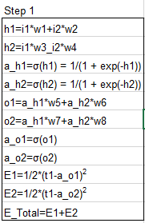
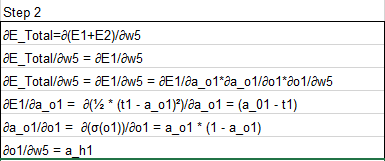
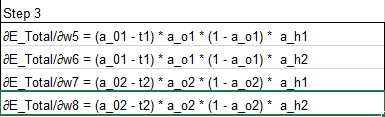
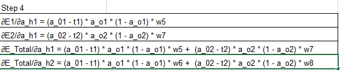

### Part - 1: Backward Propagation as laid out in asgmt_backpropagation.xlsx

<p>Here we are defining all the nodes of the neural network so we can use it to further along the 
way to the next step in backward propagation</p>


<p>Here we are calculating the partial derivatives
line 2: Since E2 is not dependent on w5, we are excluding it and calculate only for E1 which is dependent on w5
line 4: we find the partial derivative E1 w.r.t a_o1
line 5: we find the partial derivative of o1 w.r.t of w5
</p>


<p>Here we are calculating the E_Total w.r.t w5, w6, w7 and w8
</p>


<p>Here we are calculating the E_Total w.r.t w5, w6, w7 and w8
</p>
<p>
<b>NOTE:</b> Rest of the steps have been marked with post-it like sticky comments in the Excel file
</p>

### Part - 2: 
Purpose: Session 6 assignment is to try to achieve the following:
- Reduce the parameters
- Use any or all the techniques about CNN layers, loss functions etc.,
- Achieve 99.3% accuracy

## Based on MNIST dataset
### Create a simple Convolutional Neural Network model and predict

### Project Setup:
Clone the project as shown below:-

```bash
$ git clone git@github.com:pankaja0285/era_v1_session6_pankaja.git
$ cd era_v1_session6_pankaja
```
About the file structure</br>
|__asgmt_backpropagation.xlsx<br/>
|__README.md<br/>
|__S6.ipynb<br/>

**NOTE:** List of libraries required: ***torch*** and ***torchsummary***, ***tqdm*** for progress bar, which are installed using requirements.txt<br/>

One of 2 ways to run the **S6.ipynb** notebook:<br/>
1. Using Anaconda prompt - Run as an **administrator** start jupyter notebook from the folder ***era_v1_session5_pankaja*** and run it off of your localhost<br/>
**NOTE:** Without Admin privileges, the installs will not be correct and further import libraries will fail. <br/>
```
jupyter notebook
```
2. Upload the notebook folder ***era_v1_session6_pankaja*** to google colab at [colab.google.com](https://colab.research.google.com/) and run it on colab<br/>

**NOTE:** Follow along the **S6.ipynb** - notebook cells and run sequentially to see the outputs.

### Notebook execution sequence of sections is as follows:
**File used: S5.ipynb**
 1. Following the section Model - 1 for all the set up of params and training and plotting the 
    accuracies and losses
 2. Following the section Model - 2 for all the set up of params and training and plotting the 
    accuracies and losses


### Contributing:
For any questions, bug(even typos) and/or features requests do not hesitate to contact me or open an issue!
